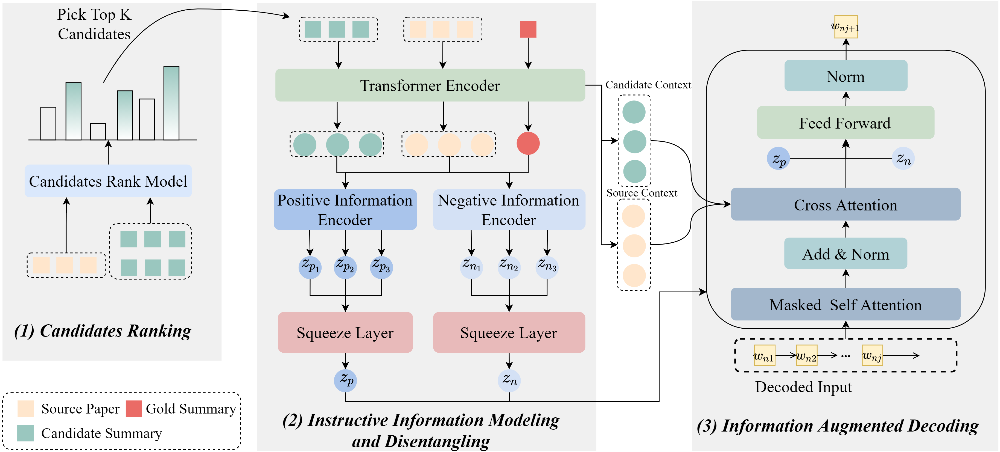

# Disentangling Instructive Information from Ranked Multiple Candidates for Multi-Document Scientific Summarization
This is the Pytorch implementation for [Disentangling Instructive Information from Ranked Multiple Candidates for Multi-Document Scientific Summarization], accepted by SIGIR 2024.

<p align="center">
 
</p>

## Requirements
* Python == 3.6.13
* torch == 1.6.0
* transformers == 4.18.0
* pyrouge == 0.1.3

## Usage
1. Create folder `trained_model`, `result` , `log` under the root directory.

2. Download Multi-Xscience Dataset from [here](https://github.com/yaolu/Multi-XScience). Download TAD and TAS2 Dataset from [Paper](https://dl.acm.org/doi/abs/10.1145/3477495.3532065)

3. Generate summary candidates for each instance of the datasets

4. Obtain the ROUGE ranking results of these summary candidates.

5. Train a candidates reranker based on 

## Training a new model
```bash
export PYTHONPATH=.

python train.py  --mode train --cuda  --data_dir <path-to-training-dataset-folder> --batch_size 2 --seed 666 --train_steps 80000 --save_checkpoint_steps 4000  --report_every 1  --visible_gpus 0 --gpu_ranks 0  --world_size 1 --accum_count 2 --dec_dropout 0.1 --enc_dropout 0.1  --model_path  ./trained_model/train_mx_vaeR1  --log_file ./log/train_source.txt  --inter_layers 6,7 --inter_heads 8 --hier --doc_max_timesteps 50 --use_bert false --prop 3 --sep_optim false --num_workers 5 --warmup_steps 8000 --lr 0.005 --enc_layers 6  --dec_layers 6 --use_nucleus_sampling false --label_smoothing 0.1  --candidate_type 0shot  --loss_kl 0.001  --loss_bow 0.01 --kl_annealing_steps 100000 --cand_num 3  --rank_type Rouge1  
```

## Test
```bash
export PYTHONPATH=.

python train.py  --mode test --cuda  --data_dir <path-to-datasets-folder> --batch_size 8 --valid_batch_size 8 --seed 666   --visible_gpus 0 --gpu_ranks 0 --dec_dropout 0.1 --enc_dropout 0.1  --lr 0.2 --label_smoothing 0.0  --log_file <path-to-log-file>  --inter_layers 6,7 --inter_heads 8 --doc_max_timesteps 50 --use_bert false --report_rouge --alpha 0.4 --max_length 400 --result_path <path-to-result-folder> --prop 3 --test_all false --sep_optim false   --use_bert false  --use_nucleus_sampling false --min_length1 100 --min_length2 110 --no_repeat_ngram_size1 3 --no_repeat_ngram_size2 3 --test_from <path-to-saved-model-checkpoint>
```

## References
```
@inproceedings{wang2024disentangling,
  title={Disentangling Instructive Information from Ranked Multiple Candidates for Multi-Document Scientific Summarization},
  author={Wang, Pancheng and Li, Shasha and Tang, Jintao and Wang, Ting},
  booktitle={Proceedings of the 47th international ACM SIGIR conference on research and development in information retrieval},
  year={2024}
}
```